# Design Document - Gallery Filter and Search Feature

## Overview

The Gallery Filter and Search feature enhances the existing gallery view by providing comprehensive filtering and search capabilities. Users can filter clothing items by size, color, and category, perform text-based searches, and combine multiple criteria for precise item discovery. The design leverages the existing MVVM architecture and extends the current GalleryViewModel and related components to support advanced filtering without disrupting the existing functionality.

## Architecture

### MVVM Architecture Integration

The feature integrates seamlessly with the existing MVVM architecture:

```
┌─────────────────────┐    ┌─────────────────────┐    ┌─────────────────────┐
│     View Layer      │    │    ViewModel        │    │    Model Layer      │
│                     │    │                     │    │                     │
│ • GalleryFragment   │◄──►│ • GalleryViewModel  │◄──►│ • ClothRepository   │
│   - Filter UI       │    │   - Filter State    │    │ • ClothDao          │
│   - Search UI       │    │   - Search Logic    │    │   - Filter Queries  │
│   - Filter Chips    │    │   - Filter Manager  │    │ • ClothItem         │
│   - Search Bar      │    │                     │    │ • TagData           │
└─────────────────────┘    └─────────────────────┘    └─────────────────────┘
```

### Component Interaction Flow

```mermaid
sequenceDiagram
    participant User as ユーザー
    participant Gallery as ギャラリー画面
    participant ViewModel as GalleryViewModel
    participant FilterManager as FilterManager
    participant Repository as ClothRepository
    participant Database as Room Database

    User->>Gallery: フィルターボタンをタップ
    Gallery->>Gallery: フィルターUIを表示
    User->>Gallery: サイズフィルターを選択
    Gallery->>ViewModel: applyFilter(FilterType.SIZE, values)
    ViewModel->>FilterManager: updateFilter(SIZE, values)
    FilterManager->>FilterManager: フィルター状態を更新
    FilterManager->>ViewModel: 更新されたフィルター条件
    ViewModel->>Repository: searchItems(filters)
    Repository->>Database: 複合条件クエリ実行
    Database-->>Repository: フィルター済みアイテム
    Repository-->>ViewModel: フィルター済みアイテム
    ViewModel-->>Gallery: UI更新（フィルター済みリスト）
    Gallery-->>User: フィルター結果を表示

    User->>Gallery: 検索テキストを入力
    Gallery->>ViewModel: performSearch(searchText)
    ViewModel->>FilterManager: updateSearchText(searchText)
    FilterManager->>ViewModel: 更新された検索条件
    ViewModel->>Repository: searchItemsWithText(filters, searchText)
    Repository->>Database: テキスト検索クエリ実行
    Database-->>Repository: 検索結果
    Repository-->>ViewModel: 検索結果
    ViewModel-->>Gallery: UI更新（検索結果）
    Gallery-->>User: 検索結果を表示
```



## Components and Interfaces

### 1. Enhanced GalleryFragment

#### New UI Components
- **Search Bar**: Material Design SearchView for text input
- **Filter Button**: FloatingActionButton or Toolbar button to access filters
- **Filter Chips**: Horizontal scrollable chip group showing active filters
- **Filter Bottom Sheet**: Modal bottom sheet containing all filter options
- **Empty State Enhancement**: Context-aware empty states for filtered results

#### Key Methods (New/Enhanced)
```kotlin
// New methods for filter UI
private fun setupFilterUI()
private fun setupSearchBar()
private fun showFilterBottomSheet()
private fun updateFilterChips(activeFilters: List<FilterChip>)
private fun clearAllFilters()

// Enhanced existing methods
private fun observeViewModel() // Enhanced to observe filter states
private fun setupRecyclerView() // Enhanced for filtered results
```

### 2. Enhanced GalleryViewModel

#### New Properties
```kotlin
// Filter and search state
private val _activeFilters = MutableLiveData<FilterState>()
val activeFilters: LiveData<FilterState> = _activeFilters

private val _searchText = MutableLiveData<String>()
val searchText: LiveData<String> = _searchText

private val _availableFilterOptions = MutableLiveData<FilterOptions>()
val availableFilterOptions: LiveData<FilterOptions> = _availableFilterOptions

private val _filteredItemCount = MutableLiveData<Int>()
val filteredItemCount: LiveData<Int> = _filteredItemCount

// Filter manager instance
private val filterManager = FilterManager()
```

#### New Methods
```kotlin
// Filter operations
fun applyFilter(filterType: FilterType, values: List<String>)
fun removeFilter(filterType: FilterType, value: String)
fun clearAllFilters()
fun clearFilter(filterType: FilterType)

// Search operations
fun performSearch(searchText: String)
fun clearSearch()

// Filter options management
fun loadAvailableFilterOptions()
fun refreshFilterOptions()

// Combined filter and search
private fun applyFiltersAndSearch()
```

### 3. New FilterManager Class

#### Purpose
Centralized management of filter state and logic, ensuring consistency across different filter types and search operations.

#### Key Properties
```kotlin
data class FilterState(
    val sizeFilters: Set<Int> = emptySet(),
    val colorFilters: Set<String> = emptySet(),
    val categoryFilters: Set<String> = emptySet(),
    val searchText: String = ""
) {
    fun hasActiveFilters(): Boolean = 
        sizeFilters.isNotEmpty() || colorFilters.isNotEmpty() || 
        categoryFilters.isNotEmpty() || searchText.isNotBlank()
    
    fun getActiveFilterCount(): Int = 
        sizeFilters.size + colorFilters.size + categoryFilters.size + 
        if (searchText.isNotBlank()) 1 else 0
}

data class FilterOptions(
    val availableSizes: List<Int>,
    val availableColors: List<String>,
    val availableCategories: List<String>
)

enum class FilterType {
    SIZE, COLOR, CATEGORY, SEARCH
}
```

#### Key Methods
```kotlin
class FilterManager {
    private var currentState = FilterState()
    
    fun updateFilter(type: FilterType, values: Set<String>): FilterState
    fun removeFilter(type: FilterType, value: String): FilterState
    fun clearFilter(type: FilterType): FilterState
    fun clearAllFilters(): FilterState
    fun updateSearchText(text: String): FilterState
    fun getCurrentState(): FilterState
    fun buildRepositoryQuery(): RepositoryQuery
}
```

### 4. Enhanced ClothRepository

#### New Methods for Advanced Filtering
```kotlin
// Text-based search across multiple fields
suspend fun searchItemsByText(
    searchText: String,
    searchFields: List<SearchField> = listOf(
        SearchField.COLOR, 
        SearchField.CATEGORY, 
        SearchField.NOTES
    )
): Flow<List<ClothItem>>

// Combined filter and search
suspend fun searchItemsWithFilters(
    sizeFilters: Set<Int>? = null,
    colorFilters: Set<String>? = null,
    categoryFilters: Set<String>? = null,
    searchText: String? = null
): Flow<List<ClothItem>>

// Get available filter options
suspend fun getAvailableFilterOptions(): FilterOptions

enum class SearchField {
    COLOR, CATEGORY, NOTES
}
```

### 5. Enhanced ClothDao

#### New Query Methods
```kotlin
// Text search across multiple fields
@Query("""
    SELECT * FROM cloth_items 
    WHERE (:searchText IS NULL OR :searchText = '' OR 
           color LIKE '%' || :searchText || '%' OR 
           category LIKE '%' || :searchText || '%')
    ORDER BY createdAt DESC
""")
fun searchItemsByText(searchText: String?): Flow<List<ClothItem>>

// Combined filters with text search
@Query("""
    SELECT * FROM cloth_items 
    WHERE (:sizeFilters IS NULL OR size IN (:sizeFilters))
    AND (:colorFilters IS NULL OR color IN (:colorFilters))
    AND (:categoryFilters IS NULL OR category IN (:categoryFilters))
    AND (:searchText IS NULL OR :searchText = '' OR 
         color LIKE '%' || :searchText || '%' OR 
         category LIKE '%' || :searchText || '%')
    ORDER BY createdAt DESC
""")
fun searchItemsWithFilters(
    sizeFilters: List<Int>?,
    colorFilters: List<String>?,
    categoryFilters: List<String>?,
    searchText: String?
): Flow<List<ClothItem>>

// Get distinct values for filter options
@Query("SELECT DISTINCT size FROM cloth_items ORDER BY size")
suspend fun getDistinctSizes(): List<Int>

@Query("SELECT DISTINCT color FROM cloth_items ORDER BY color")
suspend fun getDistinctColors(): List<String>

@Query("SELECT DISTINCT category FROM cloth_items ORDER BY category")
suspend fun getDistinctCategories(): List<String>
```

## Data Models

### FilterState Data Class
```kotlin
@Parcelize
data class FilterState(
    val sizeFilters: Set<Int> = emptySet(),
    val colorFilters: Set<String> = emptySet(),
    val categoryFilters: Set<String> = emptySet(),
    val searchText: String = ""
) : Parcelable {
    
    fun hasActiveFilters(): Boolean = 
        sizeFilters.isNotEmpty() || colorFilters.isNotEmpty() || 
        categoryFilters.isNotEmpty() || searchText.isNotBlank()
    
    fun getActiveFilterCount(): Int = 
        sizeFilters.size + colorFilters.size + categoryFilters.size + 
        if (searchText.isNotBlank()) 1 else 0
        
    fun toDisplayString(): String {
        val parts = mutableListOf<String>()
        if (sizeFilters.isNotEmpty()) {
            parts.add("サイズ: ${sizeFilters.sorted().joinToString(", ")}")
        }
        if (colorFilters.isNotEmpty()) {
            parts.add("色: ${colorFilters.joinToString(", ")}")
        }
        if (categoryFilters.isNotEmpty()) {
            parts.add("カテゴリ: ${categoryFilters.joinToString(", ")}")
        }
        if (searchText.isNotBlank()) {
            parts.add("検索: \"$searchText\"")
        }
        return parts.joinToString(" | ")
    }
}
```

### FilterOptions Data Class
```kotlin
data class FilterOptions(
    val availableSizes: List<Int> = emptyList(),
    val availableColors: List<String> = emptyList(),
    val availableCategories: List<String> = emptyList()
) {
    fun isEmpty(): Boolean = 
        availableSizes.isEmpty() && availableColors.isEmpty() && availableCategories.isEmpty()
}
```

### FilterChip Data Class (for UI)
```kotlin
data class FilterChip(
    val type: FilterType,
    val value: String,
    val displayText: String,
    val isSelected: Boolean = false
) {
    companion object {
        fun createSizeChip(size: Int, isSelected: Boolean = false) = FilterChip(
            type = FilterType.SIZE,
            value = size.toString(),
            displayText = "サイズ$size",
            isSelected = isSelected
        )
        
        fun createColorChip(color: String, isSelected: Boolean = false) = FilterChip(
            type = FilterType.COLOR,
            value = color,
            displayText = color,
            isSelected = isSelected
        )
        
        fun createCategoryChip(category: String, isSelected: Boolean = false) = FilterChip(
            type = FilterType.CATEGORY,
            value = category,
            displayText = category,
            isSelected = isSelected
        )
        
        fun createSearchChip(searchText: String) = FilterChip(
            type = FilterType.SEARCH,
            value = searchText,
            displayText = "\"$searchText\"",
            isSelected = true
        )
    }
}
```

## User Interface Design

### Filter Bottom Sheet Layout
```
┌─────────────────────────────────────┐
│ フィルター                            │
├─────────────────────────────────────┤
│ サイズ                               │
│ [60] [70] [80] [90] [100] [110]     │
│ [120] [130] [140] [150] [160]       │
├─────────────────────────────────────┤
│ 色                                  │
│ [赤] [青] [緑] [黒] [白] [その他]     │
├─────────────────────────────────────┤
│ カテゴリ                             │
│ [トップス] [ボトムス] [アウター]       │
│ [アクセサリー] [その他]               │
├─────────────────────────────────────┤
│ [すべてクリア]    [適用] [キャンセル]  │
└─────────────────────────────────────┘
```

### Search Bar Integration
```
┌─────────────────────────────────────┐
│ 🔍 衣服を検索...          [フィルター] │
├─────────────────────────────────────┤
│ Active Filters (if any):            │
│ [サイズ100 ×] [赤 ×] [検索:"シャツ" ×] │
├─────────────────────────────────────┤
│ ┌─────┐ ┌─────┐ ┌─────┐ ┌─────┐     │
│ │     │ │     │ │     │ │     │     │
│ │ 📷  │ │ 📷  │ │ 📷  │ │ 📷  │     │
│ │     │ │     │ │     │ │     │     │
│ └─────┘ └─────┘ └─────┘ └─────┘     │
└─────────────────────────────────────┘
```

### Empty State Variations
```
No Items Found (Filtered):
┌─────────────────────────────────────┐
│              🔍                     │
│        検索結果なし                   │
│                                     │
│ 指定した条件に一致するアイテムが        │
│ 見つかりませんでした。                │
│                                     │
│ • フィルターを調整してみてください      │
│ • 検索キーワードを変更してみてください   │
│                                     │
│        [フィルターをクリア]            │
└─────────────────────────────────────┘

No Items at All:
┌─────────────────────────────────────┐
│              📷                     │
│        アイテムがありません            │
│                                     │
│ 最初のアイテムを追加して               │
│ コレクションを始めましょう！            │
│                                     │
│        [写真を撮る]                  │
└─────────────────────────────────────┘
```

## Error Handling

### Filter-Specific Error Handling

#### Filter Loading Errors
- **Database Connection Issues**: Show retry dialog with fallback to cached filter options
- **Empty Filter Options**: Display informative message when no items exist for filtering
- **Filter Query Timeout**: Implement query timeout with user-friendly error message

#### Search-Specific Errors
- **Search Query Timeout**: Cancel long-running searches with timeout message
- **Invalid Search Characters**: Sanitize input and show validation errors
- **Search Result Overflow**: Limit results and show "showing first N results" message

#### Combined Filter and Search Errors
- **Conflicting Filters**: Validate filter combinations and show resolution suggestions
- **No Results Found**: Provide actionable suggestions to modify search criteria
- **Performance Issues**: Implement progressive loading for large result sets

### User Experience Error Handling

#### Graceful Degradation
- **Slow Network**: Show loading indicators with estimated completion time
- **Low Memory**: Reduce image quality and implement memory pressure handling
- **Storage Issues**: Validate available space and provide cleanup suggestions

#### Recovery Mechanisms
- **Filter State Persistence**: Save and restore filter state across app sessions
- **Search History**: Maintain recent search terms for quick access
- **Undo Functionality**: Allow users to quickly revert filter changes

## Performance Considerations

### Search and Filter Optimizations

#### Database Query Optimization
- **Indexed Columns**: Ensure size, color, and category columns are properly indexed
- **Query Caching**: Cache frequently used filter combinations
- **Pagination**: Implement cursor-based pagination for large result sets
- **Query Debouncing**: Debounce search input to reduce database load

#### UI Performance
- **Filter Chip Recycling**: Use RecyclerView for filter chips to handle large numbers
- **Lazy Loading**: Load filter options only when filter UI is accessed
- **Background Processing**: Perform filter operations on background threads
- **Result Caching**: Cache search results for recently used filter combinations

#### Memory Management
- **Filter State Optimization**: Use efficient data structures for filter state
- **Image Loading**: Optimize image loading for filtered results
- **Garbage Collection**: Minimize object creation during filter operations
- **Memory Pressure Handling**: Implement memory pressure monitoring for large collections

### Search Performance Optimizations

#### Text Search Optimization
- **Full-Text Search**: Consider implementing FTS (Full-Text Search) for better performance
- **Search Indexing**: Create composite indexes for common search patterns
- **Query Optimization**: Use EXPLAIN QUERY PLAN to optimize search queries
- **Result Ranking**: Implement relevance scoring for search results

#### Real-time Search
- **Debounced Input**: Implement 300ms debounce for search input
- **Progressive Results**: Show results as they become available
- **Search Cancellation**: Cancel previous searches when new ones are initiated
- **Minimum Query Length**: Require minimum 2-3 characters for search activation

## Security Considerations

### Input Validation and Sanitization
- **Search Input Sanitization**: Prevent SQL injection through parameterized queries
- **Filter Value Validation**: Validate all filter values against expected ranges
- **XSS Prevention**: Sanitize user input displayed in search results
- **Input Length Limits**: Enforce reasonable limits on search text length

### Data Privacy
- **Search History**: Implement secure storage for search history if enabled
- **Filter Preferences**: Encrypt stored filter preferences
- **Analytics**: Ensure search analytics comply with privacy requirements
- **Data Retention**: Implement appropriate retention policies for search data

## Accessibility Considerations

### Filter Interface Accessibility
- **Screen Reader Support**: Provide proper content descriptions for all filter controls
- **Keyboard Navigation**: Ensure all filter options are keyboard accessible
- **High Contrast**: Support high contrast mode for filter UI elements
- **Touch Target Size**: Ensure filter chips meet minimum touch target requirements

### Search Interface Accessibility
- **Search Announcements**: Announce search results count to screen readers
- **Search Suggestions**: Provide accessible search suggestions and autocomplete
- **Error Announcements**: Announce search errors and validation messages
- **Focus Management**: Properly manage focus during search operations

### Filter Results Accessibility
- **Result Announcements**: Announce when filter results change
- **Empty State Accessibility**: Provide clear guidance when no results are found
- **Filter Status**: Clearly communicate active filter status to assistive technologies
- **Navigation Shortcuts**: Provide shortcuts to quickly access filter controls

## Testing Strategy

### Unit Tests

#### FilterManager Tests
- Filter state management and transitions
- Filter combination logic and validation
- Search text processing and sanitization
- Filter option generation and caching

#### GalleryViewModel Filter Tests
- Filter application and removal
- Search functionality and debouncing
- Combined filter and search operations
- Filter state persistence and restoration

#### Repository Filter Tests
- Database query generation for filters
- Search query optimization and execution
- Filter option retrieval and caching
- Error handling for filter operations

### Integration Tests

#### Filter Workflow Tests
- Complete filter application workflow
- Search and filter combination scenarios
- Filter state persistence across app lifecycle
- Performance testing with large datasets

#### Database Integration Tests
- Filter query performance and accuracy
- Search result consistency and ordering
- Database index utilization verification
- Concurrent filter operation handling

### UI Tests (Espresso)

#### Filter UI Tests
- Filter bottom sheet interaction
- Filter chip selection and removal
- Search bar input and submission
- Empty state display for filtered results

#### Search UI Tests
- Search input validation and feedback
- Search result display and navigation
- Search history and suggestions
- Accessibility compliance verification

#### Performance UI Tests
- Filter application response time
- Search result loading performance
- UI responsiveness during filter operations
- Memory usage during intensive filtering

### Performance Tests

#### Filter Performance Tests
- Large dataset filtering performance
- Complex filter combination performance
- Search query execution time
- Memory usage during filter operations

#### Scalability Tests
- Performance with 1000+ items
- Filter option loading with diverse data
- Search performance with long text queries
- Concurrent user filter operations