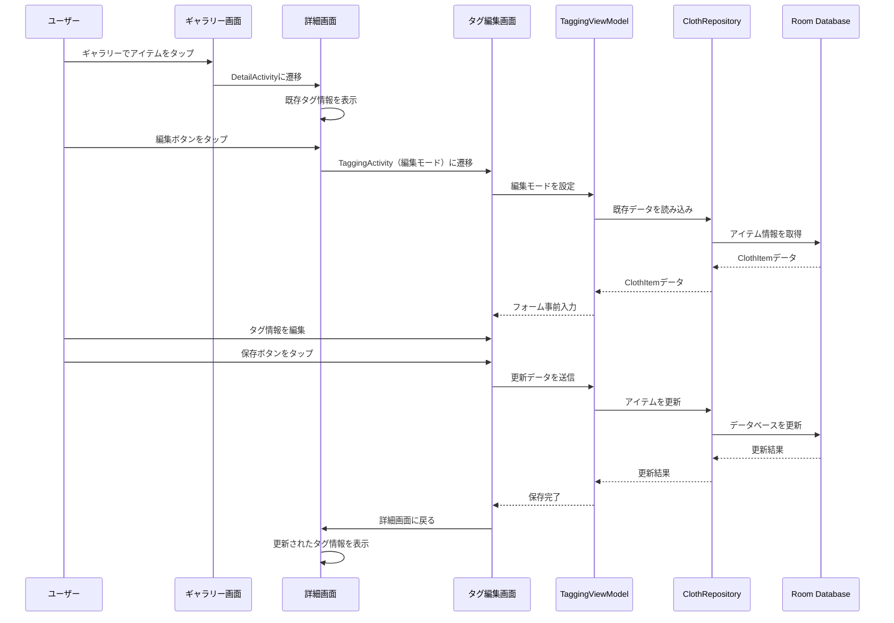

# Design Document - Gallery Tag Editing Feature

## Overview

The Gallery Tag Editing feature provides a seamless workflow for users to select clothing items from the gallery view and modify their associated tags through an intuitive editing interface. This feature leverages the existing MVVM architecture and reuses components from the photo tagging functionality to ensure consistency and maintainability. The design focuses on providing a familiar user experience while optimizing for performance and data integrity.

## Architecture

### MVVM Architecture Integration

The feature integrates with the existing MVVM architecture pattern:

```
┌─────────────────┐    ┌─────────────────┐    ┌─────────────────┐
│   View Layer    │    │  ViewModel      │    │   Model Layer   │
│                 │    │                 │    │                 │
│ • GalleryFragment│◄──►│ • GalleryViewModel│◄──►│ • ClothRepository│
│ • DetailActivity│    │ • DetailViewModel │   │ • ClothDatabase │
│ • TaggingActivity│    │ • TaggingViewModel│   │ • ClothItem     │
│   (Edit Mode)   │    │   (Edit Mode)   │   │ • TagData       │
└─────────────────┘    └─────────────────┘    └─────────────────┘
```

### Component Interaction Flow



## Components and Interfaces

### 1. Gallery Module Enhancement

#### GalleryFragment (Existing - No Changes Required)
- **Purpose**: Display clothing items in grid layout with navigation to detail view
- **Current Implementation**: Already supports item selection and navigation to DetailActivity
- **Key Methods**:
  - `navigateToDetailActivity(clothItemId: Long)`: Navigate to detail view with item ID

#### GalleryViewModel (Existing - No Changes Required)
- **Purpose**: Manage gallery data and loading states
- **Current Implementation**: Already provides LiveData for clothing items
- **Key Properties**:
  - `clothItems: LiveData<List<ClothItem>>`: Observable list of clothing items

### 2. Detail Module Enhancement

#### DetailActivity (Minor Enhancement Required)
- **Purpose**: Display full-size image and tag information with edit access
- **Current Implementation**: Basic display functionality exists
- **Required Enhancement**: Enable edit button to launch TaggingActivity in edit mode
- **Key Methods**:
  - `displayClothItem(item: ClothItem)`: Display item details (existing)
  - `navigateToTaggingActivity(clothItemId: Long)`: Launch edit mode (to be implemented)

#### DetailViewModel (Existing - No Changes Required)
- **Purpose**: Manage detail view data and loading states
- **Current Implementation**: Already loads and manages ClothItem data
- **Key Properties**:
  - `clothItem: LiveData<ClothItem>`: Observable clothing item data

### 3. Tagging Module Enhancement (Edit Mode Support)

#### TaggingActivity (Enhancement Required)
- **Purpose**: Provide tag editing interface for both new and existing items
- **Current Implementation**: Supports new item creation
- **Required Enhancement**: Add edit mode support with pre-populated fields
- **Key Components**:
  - Size picker with 10-unit increments (60, 70, 80, ..., 160)
  - Color input field
  - Category input field
  - Save/Cancel buttons
- **Key Methods**:
  - `setupEditMode(clothItemId: Long)`: Initialize edit mode (to be implemented)
  - `setupNewEntryMode()`: Initialize new entry mode (existing)
  - `displayImage(uri: Uri)`: Display clothing image (existing)

#### TaggingViewModel (Enhancement Required)
- **Purpose**: Manage tag data, validation, and save operations for both modes
- **Current Implementation**: Supports new item creation
- **Required Enhancement**: Add edit mode support with data loading and update operations
- **Key Properties**:
  - `tagData: LiveData<TagData>`: Observable tag data (existing)
  - `clothItem: LiveData<ClothItem>`: Observable item for edit mode (existing)
  - `isEditMode: Boolean`: Edit mode flag (existing)
- **Key Methods**:
  - `setEditMode(clothItemId: Long)`: Configure edit mode (existing)
  - `updateExistingItem()`: Update existing item (existing)
  - `revertToOriginal()`: Reset to original values (existing)

## Data Models

### ClothItem Entity (Existing - No Changes Required)

```kotlin
@Entity(tableName = "cloth_items")
data class ClothItem(
    @PrimaryKey(autoGenerate = true)
    val id: Long = 0,
    val imagePath: String,
    @Embedded
    val tagData: TagData,
    val createdAt: Date
)
```

### TagData Model (Enhancement Required)

```kotlin
@Parcelize
data class TagData(
    val size: Int,        // 60-160 range in 10-unit increments
    val color: String,
    val category: String
) : Parcelable, Validatable {
    
    companion object {
        const val MIN_SIZE = 60
        const val MAX_SIZE = 160
        const val SIZE_INCREMENT = 10  // New: 10-unit increments
        
        // New: Generate valid size options
        fun getValidSizeOptions(): List<Int> {
            return (MIN_SIZE..MAX_SIZE step SIZE_INCREMENT).toList()
        }
    }
}
```

### Size Picker Configuration

The size picker will be configured to show only valid options in 10-unit increments:
- Available values: [60, 70, 80, 90, 100, 110, 120, 130, 140, 150, 160]
- Default value: 100
- Validation: Only values from the valid options list are accepted

## Error Handling

### Edit Mode Specific Error Handling

#### Data Loading Errors
- Item not found: Display error message and return to gallery
- Database connection issues: Show retry dialog with fallback options
- Data corruption: Validate loaded data and show appropriate warnings

#### Edit Validation Errors
- Size validation: Ensure selected size is within valid 10-unit increment options
- Required field validation: Color and category must not be empty
- Real-time validation: Show errors immediately as user types

#### Save Operation Errors
- Update conflicts: Handle concurrent modification scenarios
- Database constraints: Manage foreign key and unique constraint violations
- Transaction failures: Implement rollback mechanisms with user feedback

### User Experience Error Handling

#### Graceful Degradation
- Network issues: Allow offline editing with sync when connection restored
- Low memory: Optimize image loading and provide memory pressure warnings
- Storage issues: Validate available space before save operations

#### Recovery Mechanisms
- Auto-save drafts: Preserve user input during unexpected interruptions
- Undo functionality: Allow reverting to original values in edit mode
- Retry options: Provide intelligent retry for transient failures

## Testing Strategy

### Unit Tests

#### TaggingViewModel Edit Mode Tests
- Edit mode initialization with valid item ID
- Pre-population of form fields with existing data
- Update operation validation and execution
- Error handling for invalid item IDs
- Change detection and unsaved changes tracking

#### TagData Model Tests
- Size increment validation (10-unit steps)
- Valid size options generation
- Validation with new size constraints
- Copy operations with size updates

### Integration Tests

#### Edit Workflow Tests
- Complete edit flow from gallery to save
- Data persistence verification after updates
- Navigation flow between activities
- Error recovery scenarios

#### Database Tests
- Update operations with concurrent access
- Transaction integrity during edit operations
- Data consistency after updates

### UI Tests (Espresso)

#### Gallery to Edit Flow
- Item selection from gallery
- Navigation to detail view
- Edit button functionality
- Return to gallery with updated data

#### Edit Interface Tests
- Size picker with 10-unit increments
- Form pre-population with existing data
- Validation error display
- Save and cancel operations

#### Error Scenario Tests
- Invalid item ID handling
- Network error recovery
- Validation error display and correction

### Performance Tests

#### Edit Mode Performance
- Data loading time for edit mode initialization
- Form rendering performance with pre-populated data
- Save operation performance for updates
- Memory usage during edit operations

## Performance Considerations

### Edit Mode Optimizations

#### Data Loading
- Lazy loading of item details only when needed
- Efficient database queries with proper indexing
- Caching of frequently edited items
- Background loading with progress indicators

#### UI Responsiveness
- Asynchronous data loading for edit mode setup
- Smooth transitions between gallery, detail, and edit views
- Optimized image loading for edit interface
- Debounced validation to reduce computation overhead

#### Memory Management
- Proper cleanup of edit mode resources
- Efficient handling of large images in edit interface
- Memory-conscious caching strategies
- Garbage collection optimization for frequent edits

### Size Picker Optimization

#### NumberPicker Configuration
- Pre-configure with valid size options only
- Optimize picker rendering for 10-unit increments
- Implement efficient value change handling
- Minimize memory footprint for picker options

## Security Considerations

### Data Integrity
- Validate all input data before database updates
- Implement proper transaction boundaries for edit operations
- Prevent SQL injection through parameterized queries
- Ensure data consistency during concurrent edits

### User Data Protection
- Secure handling of image file paths during edits
- Proper validation of file system access
- Protection against malicious input in tag fields
- Audit trail for data modifications (if required)

## Accessibility Considerations

### Edit Interface Accessibility
- Proper content descriptions for size picker
- Screen reader support for form validation errors
- Keyboard navigation support for all edit controls
- High contrast support for edit interface elements

### Size Picker Accessibility
- Announce size value changes to screen readers
- Provide alternative input methods for users with motor impairments
- Ensure sufficient touch target sizes for picker controls
- Support for voice input and switch navigation