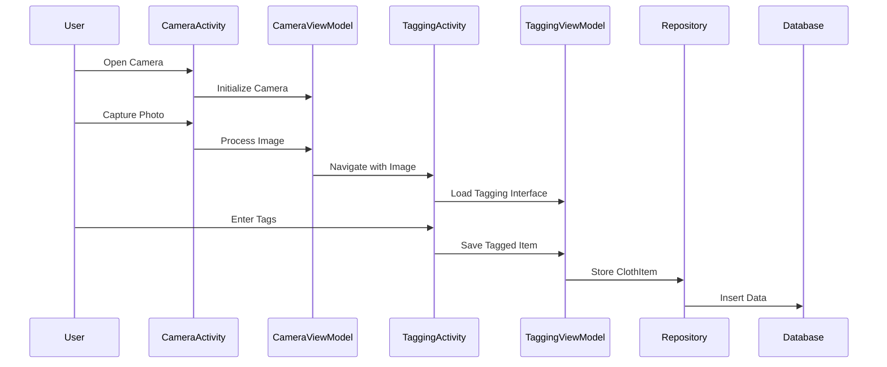

# Design Document - Photo Tagging Feature

## Overview

The photo tagging feature implements a camera-based clothing documentation system using Android's CameraX library and Room database for local storage. The feature follows MVVM architecture pattern with clear separation between UI, business logic, and data layers. The design emphasizes user experience with intuitive camera controls and streamlined tagging workflow.

## Architecture

### MVVM Architecture Pattern

```
┌─────────────────┐    ┌─────────────────┐    ┌─────────────────┐
│   View Layer    │    │  ViewModel      │    │   Model Layer   │
│                 │    │                 │    │                 │
│ • CameraActivity│◄──►│ • CameraViewModel│◄──►│ • ClothRepository│
│ • TaggingActivity│    │ • TaggingViewModel│   │ • ClothDatabase │
│ • GalleryFragment│    │ • GalleryViewModel│   │ • ClothItem     │
└─────────────────┘    └─────────────────┘    └─────────────────┘
```

### Component Interaction Flow



## Components and Interfaces

### 1. Camera Module

#### CameraActivity
- **Purpose**: Handles camera preview and photo capture
- **Key Methods**:
  - `initializeCamera()`: Set up CameraX preview and capture
  - `capturePhoto()`: Take photo and save to internal storage
  - `onPhotoConfirmed()`: Navigate to tagging interface
  - `onPhotoRejected()`: Return to camera preview

#### CameraViewModel
- **Purpose**: Manages camera state and image processing
- **Key Properties**:
  - `cameraProvider: ProcessCameraProvider`
  - `imageCapture: ImageCapture`
  - `capturedImageUri: LiveData<Uri>`
- **Key Methods**:
  - `takePicture()`: Execute photo capture
  - `processImage(uri: Uri)`: Handle captured image

### 2. Tagging Module

#### TaggingActivity
- **Purpose**: Provides interface for adding tags to photos
- **Key Components**:
  - Image preview display
  - Tag input forms (size picker 60-160, color, category)
  - Save/Cancel buttons
- **Key Methods**:
  - `displayImage(uri: Uri)`: Show captured photo
  - `setupSizePicker()`: Initialize size picker with range 60-160
  - `validateTags()`: Ensure required fields are filled
  - `saveTaggedItem()`: Create ClothItem with tags

#### TaggingViewModel
- **Purpose**: Manages tagging state and validation
- **Key Properties**:
  - `currentImage: LiveData<Uri>`
  - `tagData: MutableLiveData<TagData>`
  - `validationErrors: LiveData<List<String>>`
- **Key Methods**:
  - `updateTag(field: String, value: String)`: Update tag field
  - `validateInput()`: Check required fields
  - `saveClothItem()`: Persist to database

### 3. Gallery Module

#### GalleryFragment
- **Purpose**: Display grid of tagged clothing photos
- **Key Components**:
  - RecyclerView with ClothItemAdapter
  - Empty state view
  - Item click handling
- **Key Methods**:
  - `loadClothItems()`: Fetch from database
  - `onItemClick(item: ClothItem)`: Navigate to detail view

#### GalleryViewModel
- **Purpose**: Manages gallery data and state
- **Key Properties**:
  - `clothItems: LiveData<List<ClothItem>>`
  - `isLoading: LiveData<Boolean>`
- **Key Methods**:
  - `loadAllItems()`: Fetch all cloth items
  - `refreshData()`: Reload from database

### 4. Detail Module

#### DetailActivity
- **Purpose**: Show full-size image with tags and edit options
- **Key Components**:
  - Full-screen image view
  - Tag display layout
  - Edit button
- **Key Methods**:
  - `displayClothItem(item: ClothItem)`: Show item details
  - `onEditTags()`: Navigate to edit mode

## Data Models

### ClothItem Entity

```kotlin
@Entity(tableName = "cloth_items")
data class ClothItem(
    @PrimaryKey val id: String = UUID.randomUUID().toString(),
    val imagePath: String,
    val size: Int?, // Size range: 60-160
    val color: String?,
    val category: String?,
    val notes: String?,
    val createdAt: Long = System.currentTimeMillis(),
    val updatedAt: Long = System.currentTimeMillis()
)
```

### TagData (UI Model)

```kotlin
data class TagData(
    val size: Int? = null, // Size range: 60-160
    val color: String = "",
    val category: String = "",
    val notes: String = ""
) {
    fun isValid(): Boolean {
        return size != null && size in 60..160 && category.isNotBlank()
    }
}
```

### Database Schema

```kotlin
@Database(
    entities = [ClothItem::class],
    version = 1,
    exportSchema = false
)
abstract class ClothDatabase : RoomDatabase() {
    abstract fun clothDao(): ClothDao
}

@Dao
interface ClothDao {
    @Query("SELECT * FROM cloth_items ORDER BY createdAt DESC")
    fun getAllItems(): LiveData<List<ClothItem>>
    
    @Insert
    suspend fun insertItem(item: ClothItem)
    
    @Update
    suspend fun updateItem(item: ClothItem)
    
    @Delete
    suspend fun deleteItem(item: ClothItem)
}
```

## Error Handling

### Camera Permissions
- Check permission status before camera initialization
- Show rationale dialog for denied permissions
- Graceful fallback when camera unavailable
- Guide users to app settings for permission management

### Image Processing
- Handle storage permission issues
- Manage insufficient storage space
- Validate image file integrity
- Implement retry mechanisms for failed captures

### Database Operations
- Handle database connection failures
- Implement transaction rollback for failed saves
- Provide user feedback for operation status
- Cache data for offline scenarios

### Input Validation
- Real-time validation for tag fields
- Clear error messaging for invalid inputs
- Prevent duplicate entries
- Handle special characters in text fields

## Testing Strategy

### Unit Tests
- **ViewModels**: Test business logic and state management
- **Repository**: Test data access operations
- **Validation**: Test tag validation rules
- **Image Processing**: Test image handling utilities

### Integration Tests
- **Database**: Test Room database operations
- **Camera**: Test CameraX integration
- **Navigation**: Test activity transitions
- **File Operations**: Test image storage/retrieval

### UI Tests (Espresso)
- **Camera Flow**: Test complete photo capture workflow
- **Tagging Flow**: Test tag input and validation
- **Gallery Display**: Test item list and navigation
- **Permission Handling**: Test camera permission scenarios

### Test Coverage Goals
- Unit Tests: 80%+ coverage for business logic
- Integration Tests: Cover all data flow paths
- UI Tests: Cover critical user journeys
- Performance Tests: Image processing and database operations

## Performance Considerations

### Image Handling
- Compress images for storage efficiency
- Use appropriate image formats (JPEG for photos)
- Implement image caching for gallery display
- Lazy loading for large image collections

### Database Optimization
- Index frequently queried fields
- Use pagination for large datasets
- Implement background data loading
- Cache frequently accessed items

### Memory Management
- Proper lifecycle management for camera resources
- Release image resources when not needed
- Use weak references where appropriate
- Monitor memory usage during image operations

### UI Responsiveness
- Perform database operations on background threads
- Use coroutines for asynchronous operations
- Implement loading states for long operations
- Optimize RecyclerView performance with ViewHolder pattern