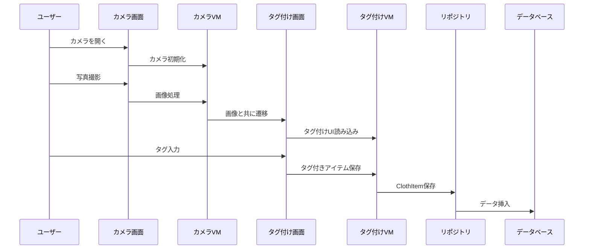

# 設計文書 - 写真タグ付け機能

## 概要

写真タグ付け機能は、AndroidのCameraXライブラリとRoomデータベースを使用したカメラベースの衣服記録システムを実装します。この機能はMVVMアーキテクチャパターンに従い、UI、ビジネスロジック、データ層の明確な分離を行います。設計では直感的なカメラコントロールと合理化されたタグ付けワークフローによるユーザーエクスペリエンスを重視しています。

## アーキテクチャ

### MVVMアーキテクチャパターン

```
┌─────────────────┐    ┌─────────────────┐    ┌─────────────────┐
│   View層        │    │  ViewModel      │    │   Model層       │
│                 │    │                 │    │                 │
│ • CameraActivity│◄──►│ • CameraViewModel│◄──►│ • ClothRepository│
│ • TaggingActivity│    │ • TaggingViewModel│   │ • ClothDatabase │
│ • GalleryFragment│    │ • GalleryViewModel│   │ • ClothItem     │
└─────────────────┘    └─────────────────┘    └─────────────────┘
```

### コンポーネント相互作用フロー



## コンポーネントとインターフェース

### 1. カメラモジュール

#### CameraActivity
- **目的**: カメラプレビューと写真撮影を処理
- **主要メソッド**:
  - `initializeCamera()`: CameraXプレビューと撮影の設定
  - `capturePhoto()`: 写真撮影と内部ストレージへの保存
  - `onPhotoConfirmed()`: タグ付けインターフェースへの遷移
  - `onPhotoRejected()`: カメラプレビューに戻る

#### CameraViewModel
- **目的**: カメラ状態と画像処理の管理
- **主要プロパティ**:
  - `cameraProvider: ProcessCameraProvider`
  - `imageCapture: ImageCapture`
  - `capturedImageUri: LiveData<Uri>`
- **主要メソッド**:
  - `takePicture()`: 写真撮影実行
  - `processImage(uri: Uri)`: 撮影画像の処理

### 2. タグ付けモジュール

#### TaggingActivity
- **目的**: 写真にタグを追加するインターフェースを提供
- **主要コンポーネント**:
  - 画像プレビュー表示
  - タグ入力フォーム（サイズピッカー60-160、色、カテゴリ）
  - 保存/キャンセルボタン
- **主要メソッド**:
  - `displayImage(uri: Uri)`: 撮影写真の表示
  - `setupSizePicker()`: 60-160範囲のサイズピッカー初期化
  - `validateTags()`: 必須フィールドの入力確認
  - `saveTaggedItem()`: タグ付きClothItemの作成

#### TaggingViewModel
- **目的**: タグ付け状態と検証の管理
- **主要プロパティ**:
  - `currentImage: LiveData<Uri>`
  - `tagData: MutableLiveData<TagData>`
  - `validationErrors: LiveData<List<String>>`
- **主要メソッド**:
  - `updateTag(field: String, value: String)`: タグフィールドの更新
  - `validateInput()`: 必須フィールドのチェック
  - `saveClothItem()`: データベースへの永続化

### 3. ギャラリーモジュール

#### GalleryFragment
- **目的**: タグ付き衣服写真のグリッド表示
- **主要コンポーネント**:
  - ClothItemAdapterを使用したRecyclerView
  - 空状態ビュー
  - アイテムクリック処理
- **主要メソッド**:
  - `loadClothItems()`: データベースから取得
  - `onItemClick(item: ClothItem)`: 詳細ビューへの遷移

#### GalleryViewModel
- **目的**: ギャラリーデータと状態の管理
- **主要プロパティ**:
  - `clothItems: LiveData<List<ClothItem>>`
  - `isLoading: LiveData<Boolean>`
- **主要メソッド**:
  - `loadAllItems()`: 全衣服アイテムの取得
  - `refreshData()`: データベースからの再読み込み

### 4. 詳細モジュール

#### DetailActivity
- **目的**: タグ付きフルサイズ画像と編集オプションの表示
- **主要コンポーネント**:
  - フルスクリーン画像ビュー
  - タグ表示レイアウト
  - 編集ボタン
- **主要メソッド**:
  - `displayClothItem(item: ClothItem)`: アイテム詳細の表示
  - `onEditTags()`: 編集モードへの遷移

## データモデル

### ClothItemエンティティ

```kotlin
@Entity(tableName = "cloth_items")
data class ClothItem(
    @PrimaryKey val id: String = UUID.randomUUID().toString(),
    val imagePath: String,
    val size: Int?, // サイズ範囲: 60-160
    val color: String?,
    val category: String?,
    val notes: String?,
    val createdAt: Long = System.currentTimeMillis(),
    val updatedAt: Long = System.currentTimeMillis()
)
```

### TagData（UIモデル）

```kotlin
data class TagData(
    val size: Int? = null, // サイズ範囲: 60-160
    val color: String = "",
    val category: String = "",
    val notes: String = ""
) {
    fun isValid(): Boolean {
        return size != null && size in 60..160 && category.isNotBlank()
    }
}
```

### データベーススキーマ

```kotlin
@Database(
    entities = [ClothItem::class],
    version = 1,
    exportSchema = false
)
abstract class ClothDatabase : RoomDatabase() {
    abstract fun clothDao(): ClothDao
}

@Dao
interface ClothDao {
    @Query("SELECT * FROM cloth_items ORDER BY createdAt DESC")
    fun getAllItems(): LiveData<List<ClothItem>>
    
    @Insert
    suspend fun insertItem(item: ClothItem)
    
    @Update
    suspend fun updateItem(item: ClothItem)
    
    @Delete
    suspend fun deleteItem(item: ClothItem)
}
```

## エラーハンドリング

### カメラ権限
- カメラ初期化前の権限状態チェック
- 拒否された権限に対する理由説明ダイアログ
- カメラ利用不可時の適切なフォールバック
- 権限管理のためのアプリ設定へのガイド

### 画像処理
- ストレージ権限問題の処理
- 不十分なストレージ容量の管理
- 画像ファイル整合性の検証
- 撮影失敗時の再試行メカニズム

### データベース操作
- データベース接続失敗の処理
- 保存失敗時のトランザクションロールバック
- 操作状態のユーザーフィードバック
- オフラインシナリオ用のデータキャッシュ

### 入力検証
- タグフィールドのリアルタイム検証
- 無効な入力に対する明確なエラーメッセージ
- 重複エントリの防止
- テキストフィールドの特殊文字処理

## テスト戦略

### ユニットテスト
- **ViewModels**: ビジネスロジックと状態管理のテスト
- **Repository**: データアクセス操作のテスト
- **Validation**: タグ検証ルールのテスト
- **Image Processing**: 画像処理ユーティリティのテスト

### 統合テスト
- **Database**: Roomデータベース操作のテスト
- **Camera**: CameraX統合のテスト
- **Navigation**: アクティビティ遷移のテスト
- **File Operations**: 画像保存/取得のテスト

### UIテスト（Espresso）
- **Camera Flow**: 完全な写真撮影ワークフローのテスト
- **Tagging Flow**: タグ入力と検証のテスト
- **Gallery Display**: アイテムリストとナビゲーションのテスト
- **Permission Handling**: カメラ権限シナリオのテスト

### テストカバレッジ目標
- ユニットテスト: ビジネスロジックの80%以上のカバレッジ
- 統合テスト: 全データフローパスのカバー
- UIテスト: 重要なユーザージャーニーのカバー
- パフォーマンステスト: 画像処理とデータベース操作

## パフォーマンス考慮事項

### 画像処理
- ストレージ効率のための画像圧縮
- 適切な画像フォーマットの使用（写真にはJPEG）
- ギャラリー表示用の画像キャッシュ実装
- 大きな画像コレクションの遅延読み込み

### データベース最適化
- 頻繁にクエリされるフィールドのインデックス化
- 大きなデータセットのページネーション使用
- バックグラウンドデータ読み込みの実装
- 頻繁にアクセスされるアイテムのキャッシュ

### メモリ管理
- カメラリソースの適切なライフサイクル管理
- 不要時の画像リソース解放
- 適切な場所での弱参照の使用
- 画像操作中のメモリ使用量監視

### UI応答性
- バックグラウンドスレッドでのデータベース操作実行
- 非同期操作でのコルーチン使用
- 長時間操作の読み込み状態実装
- ViewHolderパターンによるRecyclerViewパフォーマンス最適化